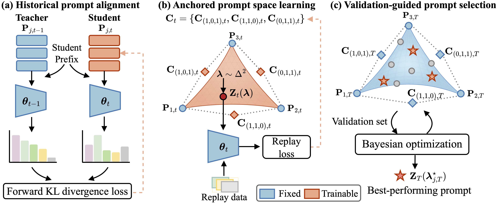

<h1 align="center">
Learning an Anchored Prompt Space for Continual Adaptation of Large Language Models
</h1>

<p align="center">
  <b>
    Rongguang Ye<sup>1,2</sup>,
    Zhan Zhuang<sup>1</sup>,
    Yichen Wu<sup>3</sup>,
    Ming Tang<sup>2</sup>,
    Kede Ma<sup>1</sup>
  </b>
</p>

<p align="center">
  <sup>1</sup>City University of Hong Kong
  &nbsp;&nbsp;
  <sup>2</sup>Southern University of Science and Technology
  &nbsp;&nbsp;
  <sup>3</sup>Harvard University
</p>


---
Official implementation of **"Learning an Anchored Prompt Space for Continual Adaptation of Large Language Models."**

## Overview

<p align="center">
  
</p>

<p align="center">
  <em>Overview of our Learning an Anchored Prompt Space (LAPS) framework.</em>
</p>

## Method

At continual stage `t`, LAPS performs four steps:

1. Learn the current task vertex, then update the backbone with SFT.
2. Recalibrate the current vertex and transport historical vertices with token-level forward KL from the preceding-stage model.
3. Freeze the backbone and all vertices, then train non-vertex control prompts with STCH.
4. After the final task, run expected-improvement search over the simplex and rerank the top candidates with repeated evaluation.

## Setup

```bash
conda create -n laps python=3.11 -y
conda activate laps
pip install -r requirements.txt
bash scripts/download_trace.sh
```

The expected data directory is `data/TRACE-Benchmark/LLM-CL-Benchmark_5000`.

Build the deterministic 1% replay buffers:

```bash
DATA_ROOT="$PWD/data/TRACE-Benchmark/LLM-CL-Benchmark_5000" \
bash scripts/prepare_replay_buffers.sh
```

## Run

```bash
bash scripts/run_laps.sh \
  --model Qwen/Qwen3-1.7B \
  --data-root "$PWD/data/TRACE-Benchmark/LLM-CL-Benchmark_5000" \
  --gold-root "$PWD/replay_buffers/gold_rho_0.01" \
  --output-dir "$PWD/output/laps_qwen3_1.7b" \
  --gpu-ids 0,1,2,3,4,5,6,7 \
  --bo-gpu-ids 0,1,2,3,4,5,6,7
```

Use `--diagonal-only-eval` to evaluate only the newly acquired task at each stage. Use `--task-order` with eight comma-separated task names to run a different stream order; build matching replay buffers with the same `TASK_ORDER` value first.

The launcher is resumable. `STAGE_COMPLETE`, `EVAL_COMPLETE`, `FULL_STREAM_COMPLETE`, `SEARCH_COMPLETE`, and `PIPELINE_COMPLETE` mark completed work.

## Layout

```text
scripts/run_laps.sh                         end-to-end entry point
scripts/run_laps_full_stream.sh             resumable continual pipeline
experiments/train_joint_slow_softprompt_vertices.py
experiments/train_trace_simplex_stch_stage.py
experiments/search_trace_simplex_bo_ei_vllm.py
src/simplex_bezier_prompt.py                Bézier simplex parameterization
```
## Citation

If you find our work useful, please consider citing:

```bibtex
@misc{ye2026laps,
  title        = {Learning an Anchored Prompt Space for Continual Adaptation of Large Language Models},
  author       = {Rongguang Ye and Zhan Zhuang and Yichen Wu and Ming Tang and Kede Ma},
  year         = {2026},
  eprint       = {2609.32499},
  archivePrefix = {arXiv}
}
```
